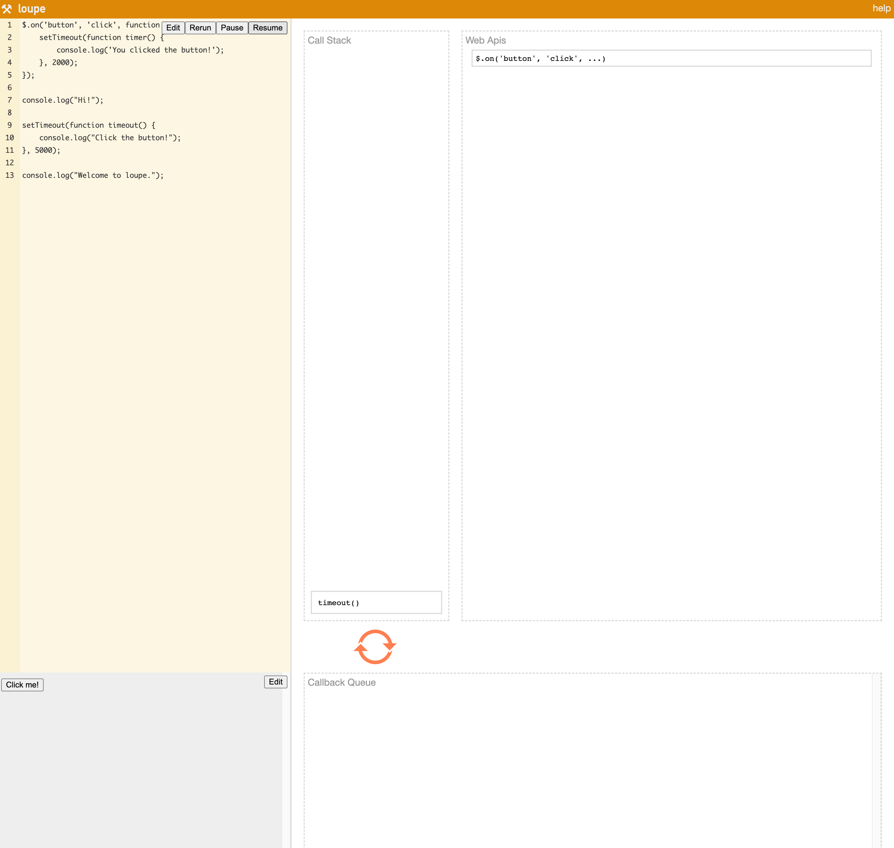

## Eventloop이란
[MDN eventloop 바로가기](https://developer.mozilla.org/ko/docs/Web/JavaScript/EventLoop)

JavaScript의 런타임 모델은 코드의 실행, 이벤트의 수집과 처리, 큐에 대기 중인 하위 작업을 처리하는 이벤트 루프에 기반하고 있으며, C 또는 Java 등 다른 언어가 가진 모델과는 상당히 다르다.

## Eventloop의 구성

### 스택
함수들의 호출로 '프레임' 스택이 쌓이게 된다.

```javascript
function foo(b) {
  let a = 10
  return a + b + 11
}

function bar(x) {
  let y = 3
  return foo(x * y)
}

const baz = bar(7) // 42를 baz에 할당
```
위의 코드가 실행될때 스택에 쌓이고 나가는 순서는 아래와 같다.

- bar(7) Stack Push
- foo(21) Stack Push
- foo(21) 값 반환 후 POP
- bar(7) 값 반환 후 POP

### 힙
객체는 힙에 할당됩니다. 힙은 단순히 메모리의 큰 (그리고 대부분 구조화되지 않은) 영역을 지칭하는 용어입니다.


### 큐

JavaScript 런타임은 메시지 큐, 즉 처리할 메시지의 대기열을 사용합니다. 각각의 메시지에는 메시지를 처리하기 위한 함수가 연결돼있습니다.

이벤트 루프의 임의 시점에, 런타임은 대기열에서 가장 오래된 메시지부터 큐에서 꺼내 처리하기 시작합니다. 이를 위해 런타임은 꺼낸 메시지를 매개변수로, 메시지에 연결된 함수를 호출합니다. 다른 함수와 마찬가지로, 호출로 인한 새로운 스택 프레임도 생성됩니다.

함수 처리는 스택이 다시 텅 빌 때까지 계속됩니다. 그 후, 큐에 메시지가 남아있으면 같은 방법으로 처리를 계속 진행합니다.

### 이벤트 루프 동작 순서 시각적으로 보기

이벤트 루프가 실제로 어떻게 진행되는지 시각적으로 보기 좋은 사이트가 있어서 퍼왔다.

[이벤트 루프 예시 사이트 loupe 보러가기](http://latentflip.com/loupe/?code=JC5vbignYnV0dG9uJywgJ2NsaWNrJywgZnVuY3Rpb24gb25DbGljaygpIHsKICAgIHNldFRpbWVvdXQoZnVuY3Rpb24gdGltZXIoKSB7CiAgICAgICAgY29uc29sZS5sb2coJ1lvdSBjbGlja2VkIHRoZSBidXR0b24hJyk7ICAgIAogICAgfSwgMjAwMCk7Cn0pOwoKY29uc29sZS5sb2coIkhpISIpOwoKc2V0VGltZW91dChmdW5jdGlvbiB0aW1lb3V0KCkgewogICAgY29uc29sZS5sb2coIkNsaWNrIHRoZSBidXR0b24hIik7Cn0sIDUwMDApOwoKY29uc29sZS5sb2coIldlbGNvbWUgdG8gbG91cGUuIik7!!!PGJ1dHRvbj5DbGljayBtZSE8L2J1dHRvbj4%3D)


속도가 조금 빠른 느낌이 있지만 자바스크립트가 실제로 어떻게 실행이 되는지 알아보기 쉽게 만들어져 있다.

